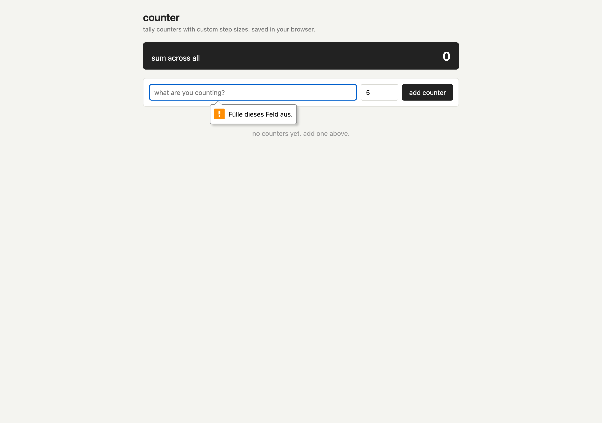

# counter



tally counter, run several at once with custom step sizes.

each counter has a label, a step size, +/- buttons and a reset. there is a running sum across all of them at the top. step can be negative if you want a decrementer instead. everything saves to localStorage so it survives a refresh.

## run it

just open `index.html` in a browser. no build, no install.

```
git clone https://github.com/secanakbulut/counter.git
cd counter
open index.html
```

## license

PolyForm Noncommercial 1.0.0. fine for personal use, not for resale or commercial use without asking.
